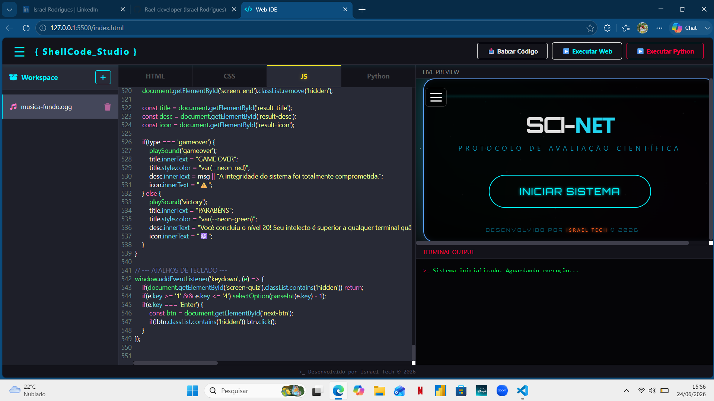

# 💻 { ShellCode_Studio }

## 🚀 Novidades da Última Versão (Atualização VFS)

🔗 *[Click aqui para conhecer o shellcode_studio!](https://rael-developer.github.io/shellcode_studio/)*

O *ShellCode Studio* recebeu uma grande atualização focada em gerenciamento de assets e imersão, trazendo recursos de IDEs de mesa para o navegador:

* 📁 *File Explorer Integrado:* Nova barra lateral (Workspace) no estilo VS Code, responsiva e com menu off-canvas para dispositivos mobile.
* 🧠 *Sistema de Arquivos Virtual (VFS):* Motor de processamento que permite importar imagens e áudios (como .ogg e .png) diretamente para a IDE gerando URLs em memória (Blob URLs), mantendo a arquitetura 100% Client-Side sem necessidade de backend.
* ♻️ *Gerenciamento de Memória RAM:* Sistema inteligente de lixeira que exclui assets do projeto e utiliza URL.revokeObjectURL() para limpar o cache da máquina do usuário instantaneamente.
* ⚡ *Interceptador de Código:* Motor que faz o parse automático do HTML/JS e substitui nomes de arquivos estáticos pelos links virtuais da memória antes da injeção no Live Preview.
* 🎨 *UI/UX Aprimorada:* Adição de ícones vetoriais (FontAwesome), painel de contatos reestilizado em neon e atalhos de clique duplo para copiar nomes de arquivos para a área de transferência.
---

Uma IDE Web Client-Side de alta performance projetada com uma estética cyberpunk/neon. O **ShellCode Studio** permite a renderização em tempo real de interfaces front-end e a compilação nativa de scripts Python diretamente no navegador, garantindo produtividade e segurança sem a necessidade de servidores remotos.
---
### 🚫 O que o ShellCode Studio NÃO é
* **Não é um software pesado (Electron-based):** Diferente de editores Desktop tradicionais que consomem gigabytes de memória RAM, ele roda de forma ultra-leve diretamente sobre o motor do seu navegador web.
* **Não é dependente de Backend na nuvem:** A ferramenta não realiza requisições para servidores externos para processar lógicas ou renderizar códigos. Todo o ecossistema é processado na máquina do cliente.
* **Não é restrito ao Desktop:** Sua arquitetura foi testada e otimizada desde o nível Mobile (com sistemas de auto-fechamento de tags para teclados virtuais) até resoluções ultrawide para monitores de PC.
---
### ✅ O que o ShellCode Studio É
* **Uma IDE Web 100% Client-Side:** Um ecossistema completo de desenvolvimento que funciona inteiramente no lado do cliente.
* **Um Compilador Híbrido em Tempo Real:** Capaz de injetar e renderizar dinamicamente projetos Front-end (HTML/CSS/JS) em um *Live Preview*, além de compilar e executar algoritmos Python nativamente utilizando WebAssembly.
* **Um Ambiente de Digitação Inteligente:** Equipado com atalhos tipo Emmet (geração de boilerplates com `!`) e um motor exclusivo de auto-fechamento semântico de tags.
---
### 🎯 Por que o ShellCode Studio é a solução ideal? (Problema vs. Solução)
O desenvolvimento moderno muitas vezes é sabotado por ambientes de configuração complexa ou pela necessidade de conectividade constante. O ShellCode Studio foi arquitetado para contornar esses atritos:

| O Cenário / Problema | A Solução do ShellCode Studio |
| :--- | :--- |
| **Consumo de Hardware:** Abrir IDEs pesadas para testar lógicas rápidas causa travamentos em máquinas modestas. | **Arquitetura Serverless Local:** Inicialização instantânea. O interpretador Python baixa (WASM) uma vez e roda localmente sem consumir recursos em background. |
| **Limitação Mobile:** Editores em smartphones ignoram auto-fechamento de tags, pois teclados virtuais não enviam os mesmos sinais físicos que os PCs. | **Motor de Interceptação Semântica:** Um script dedicado lê as alterações na tela, injeta as tags corretas e reposiciona o cursor automaticamente. |
| **Testes de Backend Lentos:** Validar envios de formulários ou retenção de dados exige subir servidores Node/PHP paralelos. | **Simulação de Ciclo Completo (Mocking):** Facilita a simulação de persistência de banco de dados diretamente via `localStorage` e scripts na aba JS. |

---
### 📥 Destaque: Exportação Nativa (Download Contextual)
O sistema conta com um motor inteligente de exportação de código. Ao clicar em **"Baixar Código"**, o ShellCode Studio analisa qual aba está ativa e gera dinamicamente um arquivo físico com a extensão correta (`.html`, `.css`, `.js` ou `.py`). O download ocorre nativamente, de forma segura e sem transitar seus dados pela rede.
---
### 🚀 Como Utilizar
A ferramenta pode ser rodada de forma local em sua máquina ou hospedada facilmente em servidores web para acesso global.
1. **Acesse a aplicação** através do arquivo `index.html` (via Live Server local) ou pelo link web de produção (em breve via GitHub Pages).
2. **Navegue pelas abas (fichários)** para escrever a estrutura (HTML), o design neon (CSS) e a lógica (JS/Python).
3. Clique em **▶ Executar Web** para atualizar o painel lateral de *Live Preview* ou **▶ Executar Python** para injetar a engine WASM e interagir via Terminal.
4. Utilize a integração do `localStorage` na aba JS para validar simulações de Backend, retendo inputs e interações em tempo real.
---
### 🛠️ Tecnologias e Linguagens Utilizadas
* **HTML5:** Estruturação semântica, gerenciamento de layouts e isolamento seguro do Preview via `iframes` (`srcdoc`).
* **CSS3:** Design e identidade visual com variáveis CSS para o tema dark/neon, além de Flexbox para responsividade total.
* **JavaScript ES6+:** Core lógico da aplicação, gerenciamento do DOM, manipulação de arquivos dinâmicos (Blobs) e engine de interceptação de texto.
* **CodeMirror 5:** Biblioteca de renderização dos editores, responsável pelo *Syntax Highlighting* e numeração de linhas.
* **Pyodide (WASM):** Portabilidade do CPython para WebAssembly, permitindo a execução de códigos Python complexos diretamente no escopo do navegador de forma *sandboxed*.
---

  <i>Sistema arquitetado e desenvolvido por <b>Israel Tech</b>. Focado em produtividade, segurança client-side e interfaces imersivas.</i>

